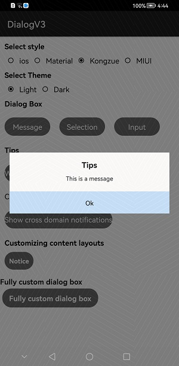

## DialogV3

## Introduction:
This will provide different types of dialogs for iOS, MIUI, Material and Kongzue themes and for dark and light modes.


## Usage Instructions:
1. Message Dialog diaplay
MessageDialog.show(getContext(), "Tips", "This is a message", "Ok");





2. Selection dialog diaplay

MessageDialog.show(getContext(), "Tips", "This is a message", "Ok", "cancel", "back")
                    .setButtonOrientation(LayoutAlignment.VERTICAL_CENTER);


3. Input dialog display

 InputDialog.build(getContext())
                        .setTitle("prompt").setMessage("Please enter the password(123456)")
                        .setInputText("111111")
                        .setOkButton("ok", new OnInputDialogButtonClickListener(){

                            @Override
                            public boolean onClick( String inputStr) {
                                if (inputStr.equals("123456")) {
                                    TipDialog.show(getContext(), "success!", TipDialog.TYPE.SUCCESS);
                                    return false;
                                } else {
                                    TipDialog.show(getContext(), "Incorrect password", TipDialog.TYPE.ERROR);
                                    return true;
                                }
                            }
                        })
                        .setCancelButton("cancel")
                        .setHintText("Please enter the password")
                        .setInputInfo(new InputInfo()
                                        .setMAX_LENGTH(6)
                        )
                        .setCancelable(true)
                        .show(getContext());


4.  Wait dialog

WaitDialog.show(getContext(), "Test")
                           .setOnBackClickListener(new OnBackClickListener() {
                               @Override
                               public boolean onBackClick() {
                                   toast("Press return!");
                                   return false;
                               }
                           });
                   WaitDialog.dismiss(3000);


5. Wait + prompt dialog

 WaitDialog.show(getContext(), "Please wait...");
                EventHandler handler = new EventHandler(EventRunner.getMainEventRunner());
                handler.postTask(new Runnable() {
                    @Override
                    public void run() {
                        getUITaskDispatcher().asyncDispatch(() -> {
                            TipDialog.show(getContext(), "success", TipDialog.TYPE.SUCCESS).setOnDismissListener(new OnDismissListener() {
                                @Override
                                public void onDismiss() {

                                }
                            });
                        });
                    }
                }, 1000);


6. Notice
The notification here is not a system notification, and does not have the feature of persistent display in the notification bar of your device. It is essentially a cross-interface prompt bar at the top of the screen realized by modifying Toast.

It does not depend on the interface display and will not interrupt the user's operation. It can be used as an instant messaging IM software cross-interface message reminder, or used for network error status prompts.

Use the following code to quickly build the notification:

Notification.show(MainActivity.this, "prompt", "Prompt message");

Icon, click, and close events need to be added£º

Notification.show(MainActivity.this, "prompt", "Prompt message", R.mipmap.ico_wechat).setOnNotificationClickListener(new OnNotificationClickListener() {
    @Override
    public void onClick() {
        //Click Action
    }
}).setOnDismissListener(new OnDismissListener() {
    @Override
    public void onDismiss() {
        //Dismiss Action
    }
});

Supports two types of Notifications, 

Notification.mode = Notification.Mode.TOAST;                
Notification.mode = Notification.Mode.FLOATING_WINDOW;

to enable cross-window floating window permissions add below permission to config.json:

"reqPermissions": [
      {
        "name": "ohos.permission.SYSTEM_FLOAT_WINDOW"
      }
   ]


7. Custom Dialog
Kongzue Dialog V3 provides a fully customizable dialog box style for quick and easy realization of special effects.

Use the following code to create a custom dialog:

//with uninstantiated layouts£º
CustomDialog.show(this, ResourceTable.Layout_layout_custom_dialog, new CustomDialog.OnBindView() {
    @Override
    public void onBind(final CustomDialog dialog, Component v) {
        Image btnOk = v.findViewById(R.id.btn_ok);
        
        btnOk.setClickedListener(new Component.ClickedListener() {
            @Override
            public void onClick(Component v) {
                dialog.doDismiss();
            }
        });
    }
});

//with instantiated layouts£º
Component customView;
CustomDialog.show(MainActivity.this, customView, new CustomDialog.OnBindView() {
    @Override
    public void onBind(final CustomDialog dialog, Component v) {
        Image btnOk = v.findViewById(R.id.btn_ok);
        
        btnOk.setClickedListener(new Component.ClickedListener() {
            @Override
            public void onClick(Component v) {
                dialog.doDismiss();
            }
        });
    }
});

8. Bottom Menu:
Normal Bottom menu:
 BottomMenu.show(this, new String[]{"Menu1", "Menu2", "Menu3"}, new OnMenuItemClickListener() {
                @Override
                public void onClick(String text, int index) {
                    toast("Clicked£º" + text);
                }
            });
With Header:
  BottomMenu.show(this, "Here is the title text", new String[]{"Menu1", "Menu2", "Menu3"}, new OnMenuItemClickListener() {
                @Override
                public void onClick(String text, int index) {
                    toast("Clicked£º" + text);
                }
            });
Custom:
 BottomMenu.show(this, new String[]{"Menu1", "Menu2", "Menu3"}, new OnMenuItemClickListener() {
                @Override
                public void onClick(String text, int index) {
                     toast(text);
                }
            }, ResourceTable.Layout_layout_custom, new BottomMenu.OnBindView() {
                @Override
                public void onBind(BottomMenu bottomMenu, Component v) {
                    v.setClickedListener(new Component.ClickedListener() {
                        @Override
                        public void onClick(Component component) {
                            toast("Clicked on Custom Layout");
                        }
                    });
                }
            });


## Installation instructions:
Method 1:
    Generate the .har package through the library and add the .har package to the libs folder.
    Add the following code to the entry gradle:
        implementation fileTree  (dir: 'libs', include: ['*.jar', '*.har'])

Method 2:

Add following dependencies in entry build.gradle:**

    entry build.gradle:
    dependencies {
            implementation project(':dialog')
    }

Method 3:

For using DialogV3 from a remote repository in separate application, add the below dependency in entry/build.gradle file.
```
implementation 'io.openharmony.tpc.thirdlib:DialogV3:1.0.0'
```

## License

Copyright Kongzue DialogV3

Licensed under the Apache License, Version 2.0 (the "License");
you may not use this file except in compliance with the License.
You may obtain a copy of the License at

 http://www.apache.org/licenses/LICENSE-2.0

Unless required by applicable law or agreed to in writing, software
distributed under the License is distributed on an "AS IS" BASIS,
WITHOUT WARRANTIES OR CONDITIONS OF ANY KIND, either express or implied.
See the License for the specific language governing permissions and
limitations under the License.